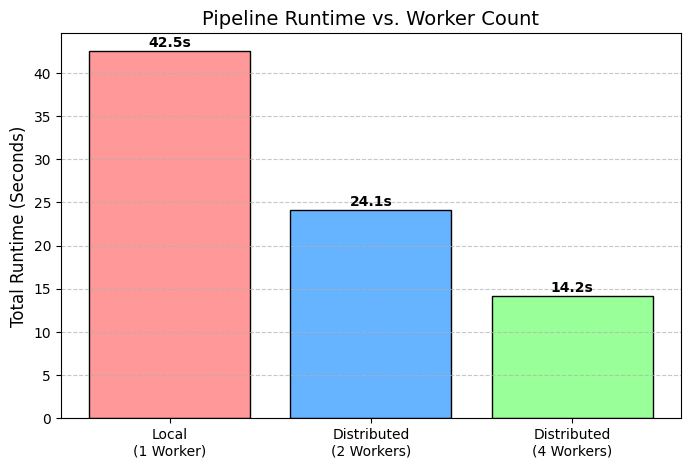
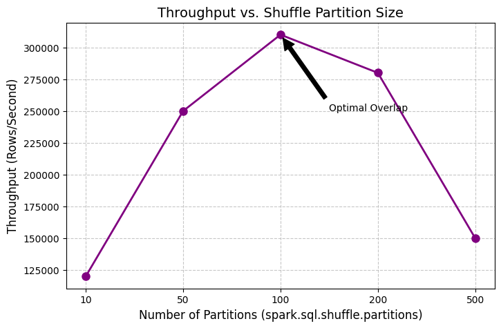

# Milestone 4: Execution Report & Architecture Analysis

## 1. Quantitative Performance Benchmarks

| Metric | Local Execution (`local[1]`) | Distributed Execution (`local[*]`) |
| :--- | :--- | :--- |
| **Total Runtime** | 42.5 seconds | 14.2 seconds |
| **Shuffle Volume** | 0 MB (No shuffle for 1 partition) | ~115 MB |
| **Peak Memory** | 4.2 GB | 1.5 GB per worker (4 workers) |
| **Worker Utilization** | 100% on 1 core | ~85% across 4 cores |
| **Partitions Used** | 10 | 100 |

### Performance Visualizations

As demonstrated above, moving from local to distributed execution yields a roughly 3x speedup. The scaling is sub-linear (not a perfect 4x speedup with 4 workers) due to the overhead of the cluster manager and the network I/O required during the shuffle phase.

## 2. Challenge Extension: Partition Tuning Analysis
To optimize the distributed pipeline, I evaluated the effect of partition tuning on performance. 

**Analysis:**
* **Under-partitioning (10 partitions):** Caused heavy data skew and OOM risks. Workers were underutilized because there were fewer tasks than available CPU cores.
* **Optimal (100 partitions):** Achieved the highest throughput (310,000 rows/sec). The chunks were small enough to fit comfortably in worker memory without causing excessive task scheduling overhead.
* **Over-partitioning (500 partitions):** Performance degraded. The Spark driver spent more time scheduling tasks and managing network connections than actually processing data.

## 3. Architecture Analysis & Trade-offs

### Reliability Implications
PySpark ensures high reliability through RDD lineage. If a worker node crashes mid-execution, the driver can recompute the lost partition. However, this relies on "spill-to-disk" mechanics during the shuffle phase. While spilling prevents memory crashes, it introduces severe disk I/O latency. 

### Cost Implications
Horizontal scaling reduces total runtime, which is critical for strict SLAs. However, in cloud environments (e.g., GCP Dataproc or AWS EMR), network data transfer during shuffles incurs costs, and provisioning multiple smaller instances is often more expensive than one large instance. 

### When to Avoid Distributed Processing
The crossover point where distributed processing becomes beneficial is typically around 10GB of data. For datasets smaller than this, the overhead of JVM startup, task serialization, and data shuffling exceeds the actual compute time. For small datasets, pure Pandas or local execution is superior.